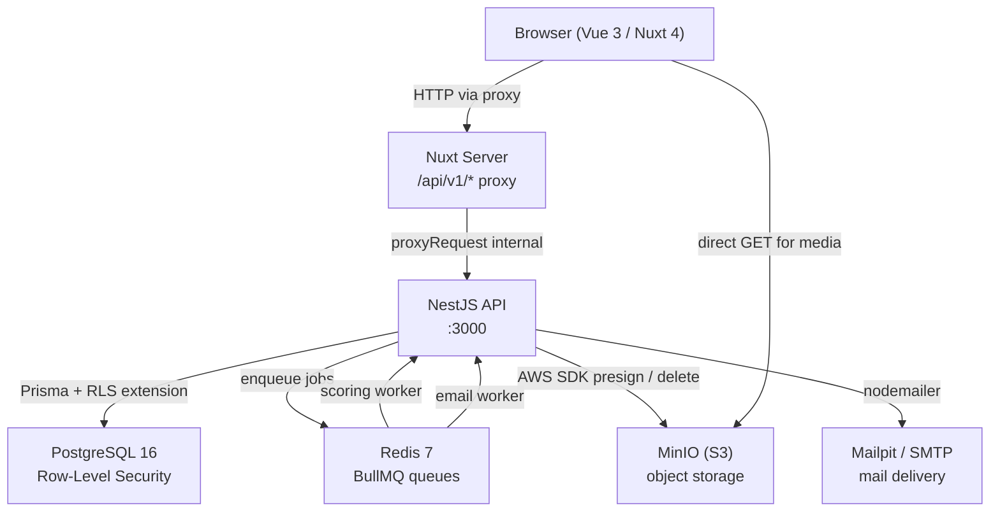

<!-- generated-by: gsd-doc-writer -->
# Architecture

## System overview

Kovia is a smart pet adoption platform composed of two independent applications: a NestJS REST API backend and a Nuxt 4 server-side-rendered frontend. The backend exposes all business logic over HTTP, persists data in PostgreSQL via Prisma ORM with row-level security, offloads async work (scoring and email) to Redis-backed BullMQ queues, and stores media files in an S3-compatible object store (MinIO in development). The frontend proxies all API calls through a Nuxt server route to avoid CORS and third-party cookie issues, and renders pages using four distinct layouts keyed to user role. Authentication is handled with short-lived JWT access tokens and an httpOnly refresh cookie; Google OAuth 2.0 is supported alongside local email/password.

---

## Component diagram



---

## Data flow

A typical adoption application submission follows this path:

1. An authenticated adopter submits a multi-step form from the browser (`/animales/{id}`).
2. The Nuxt frontend sends a `POST /api/v1/applications` request to the Nuxt server route proxy (`server/routes/api/v1/[...].ts`).
3. The proxy forwards the request verbatim to `http://api:3000/applications` (Docker-internal network), carrying the JWT `Authorization` header and the httpOnly refresh cookie.
4. NestJS's global `JwtAuthGuard` validates the access token; `RolesGuard` checks role permissions; `TenantInterceptor` reads the authenticated user's `id` and `organizationId` from the request and stores them in a `nestjs-cls` context store.
5. `ApplicationsService.create` uses the RLS-extended Prisma client (`PRISMA_RLS`) which, on every database operation, issues `SET LOCAL app.current_org_id = ...` and `SET LOCAL app.current_user_id = ...` within the same connection batch, enforcing PostgreSQL row-level security policies for tenant isolation.
6. After persisting the application, the service enqueues a `scoring` job to BullMQ (`@nestjs/bullmq`).
7. The `ScoringProcessor` worker dequeues the job, fetches the full application with animal and species data, calls the pure `scoreApplication` engine function, and writes the computed `score` and `scoreDetails` back to the `adoption_applications` row.
8. The org admin sees the scored application in the dashboard with a risk badge and red-flag alerts.

For media uploads, the flow is:

1. The client calls `POST /upload/presigned-url` to obtain a time-limited S3 presigned URL.
2. The browser uploads the file directly to MinIO using the presigned URL (no data passes through the API).
3. Photo records (`AnimalPhoto` or `ApplicationPhoto`) are created through the animals or applications routes after the upload completes.

---

## Key abstractions

| Abstraction | File | Description |
|---|---|---|
| `AppModule` | `backend/src/app.module.ts` | Root NestJS module; registers global guards (`JwtAuthGuard`, `RolesGuard`), global interceptor (`TenantInterceptor`), and global exception filter (`HttpExceptionFilter`). |
| `PrismaService` | `backend/src/prisma/prisma.service.ts` | Extends `PrismaClient` with the `@prisma/adapter-pg` driver adapter for native PostgreSQL connections. |
| `PRISMA_RLS` (injection token) | `backend/src/prisma/prisma.module.ts` | A Prisma client extended with the RLS query middleware; injects `SET LOCAL` config vars on every operation to activate row-level security policies. |
| `createRlsExtension` | `backend/src/prisma/prisma-rls.extension.ts` | Prisma `$extends` factory that wraps every database operation in a batch transaction containing `set_config` calls for `app.current_org_id`, `app.current_user_id`, and `app.is_admin`. |
| `TenantInterceptor` | `backend/src/tenant/tenant.interceptor.ts` | Global NestJS interceptor that copies the authenticated user's `id`, `organizationId`, and `role` into the CLS store so the RLS extension can read them per-request. |
| `scoreApplication` | `backend/src/scoring/engine.ts` | Pure function (no side effects) that evaluates an adoption application across five weighted categories and returns a total score (0-100), risk level, category breakdown, and red flags. |
| `ScoringProcessor` | `backend/src/scoring/scoring.processor.ts` | BullMQ worker that dequeues scoring jobs, fetches the application, calls `scoreApplication`, and persists the result. |
| `MailProcessor` | `backend/src/mail/mail.processor.ts` | BullMQ worker that dequeues email jobs and delivers them via `@nestjs-modules/mailer` with Handlebars templates. |
| `useAuthStore` | `frontend/app/stores/auth.ts` | Pinia store managing access token, user profile, and all auth actions (login, register, Google OAuth callback, token refresh, logout). |
| `proxyRequest` catch-all | `frontend/server/routes/api/v1/[...].ts` | Nuxt server route that proxies every `/api/v1/*` request to the backend, enabling cookie forwarding without CORS restrictions. |

---

## Scoring engine

The `scoreApplication` function in `backend/src/scoring/engine.ts` scores adoption applications across five categories with a combined maximum of 100 points:

| Category | Max points | Key factors |
|---|---|---|
| Vivienda y ambiente | 25 | Housing type, ownership status, pet permission, outdoor space, photos |
| Composicion del hogar | 20 | Children compatibility, dog/cat compatibility |
| Experiencia e historial | 20 | Prior pet ownership, prior outcome, species-specific experience, adults in household |
| Compatibilidad de estilo de vida | 20 | Hours alone per day (species-adjusted), activity level match, adoption reason sentiment |
| Senales de compromiso | 15 | Number of photos, social media provided, additional context length, form completeness |

Risk levels are assigned as:

- `bajo_riesgo` — score >= 80
- `riesgo_moderado` — score >= 60
- `requiere_revision` — score >= 40
- `alto_riesgo` — score < 40

Hard red flags (e.g., renter with no pet permission, animal incompatible with children present) override the numeric risk level to `alto_riesgo` regardless of score. Medium red flags escalate `bajo_riesgo` or `riesgo_moderado` to `requiere_revision`.

---

## Directory structure rationale

```
kovia/
├── backend/                  # NestJS REST API (Node.js, TypeScript)
│   ├── src/
│   │   ├── admin/            # PLATFORM_ADMIN endpoints (users, orgs, invites, species)
│   │   ├── adopters/         # Read-only adopter profile and history endpoints
│   │   ├── animals/          # CRUD for animals within an organization
│   │   ├── application-notes/# Internal staff notes on adoption applications
│   │   ├── applications/     # Adoption application lifecycle and status transitions
│   │   ├── audit/            # Global audit log service (action tracking)
│   │   ├── auth/             # JWT, local, Google OAuth strategies, guards, email verification
│   │   ├── common/           # Shared decorators (@Public, @Roles, @CurrentUser) and filters
│   │   ├── generated/        # Prisma-generated client (do not edit manually)
│   │   ├── mail/             # BullMQ email worker and Handlebars templates
│   │   ├── organizations/    # Organization profile and invite flow
│   │   ├── prisma/           # PrismaService, RLS extension, and module
│   │   ├── scoring/          # Scoring engine, BullMQ processor, and service
│   │   ├── species/          # Species reference data
│   │   ├── tenant/           # TenantInterceptor for CLS context propagation
│   │   └── upload/           # S3 presigned URL generation and photo record management
│   └── prisma/
│       ├── schema.prisma     # Single-file Prisma schema (all models and enums)
│       ├── migrations/       # Prisma migration history
│       └── init.sql          # PostgreSQL init script (creates app_user role)
│
├── frontend/                 # Nuxt 4 SSR frontend (Vue 3, TypeScript)
│   ├── app/
│   │   ├── components/       # Reusable Vue components (animals/, applications/, brand/)
│   │   ├── composables/      # useApi, useAuth, useApplicationDraft, useRelativeTime
│   │   ├── layouts/          # Role-scoped layouts (default, auth, org, admin)
│   │   ├── middleware/        # Route guards (auth, guest, org, admin, org-setup)
│   │   ├── pages/            # File-based routing: auth, org/dashboard, admin, animales
│   │   ├── plugins/          # Vue plugin registrations
│   │   └── stores/           # Pinia stores (auth.ts)
│   ├── server/routes/api/v1/ # Catch-all proxy to backend (h3 proxyRequest)
│   └── i18n/locales/         # Translations (es-SV.json — Spanish El Salvador only)
│
└── docker-compose.yml        # Full local dev stack (api, web, postgres, redis, minio, mailpit)
```

---

## Authentication and authorization

Authentication uses a dual-token strategy:

- **Access token** — short-lived JWT (15 minutes), sent as a `Bearer` header on every API request.
- **Refresh token** — long-lived JWT stored in an httpOnly cookie (`refresh_token`); used by `POST /auth/refresh` to obtain a new access token without re-login.

Three Passport strategies are active: `local` (email/password), `jwt` (access token), and `jwt-refresh` (refresh cookie). Google OAuth 2.0 is available via `passport-google-oauth20`.

Authorization uses two global guards registered in `AppModule`:

- `JwtAuthGuard` — enforces authentication on all routes unless decorated with `@Public()`.
- `RolesGuard` — enforces role membership based on `@Roles(...)` decorator values. Roles are `ADOPTER`, `ORG_ADMIN`, and `PLATFORM_ADMIN`.

---

## Infrastructure services

| Service | Image | Dev port | Purpose |
|---|---|---|---|
| PostgreSQL 16 | `postgres:16` | 5432 | Primary relational database with RLS |
| Redis 7 | `redis:7-alpine` | 6380 (host) | BullMQ queue broker |
| MinIO | `minio/minio:latest` | 9000 (API), 9001 (console) | S3-compatible object storage for photos |
| Mailpit | `axllent/mailpit:latest` | 8025 (UI), 1025 (SMTP) | Local email capture and inspection |
| NestJS API | custom Dockerfile | 3000 | Backend REST API |
| Nuxt frontend | custom Dockerfile | 3001 | SSR frontend |

The Nuxt frontend communicates with the API exclusively through its own server-side proxy route (`/api/v1/*` → `http://api:3000`). This means browser requests never reach the backend directly, keeping cookies same-origin and CORS headers unnecessary.
